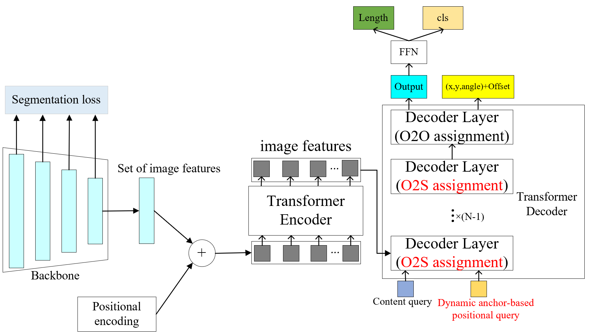

<div align=center></div>

# O2SFormer
Pytorch implementation of our paper [End-to-End Lane detection with One to Several Transformer](https://arxiv.org/pdf/2305.00675.pdf).

# News
[2023/5/9]: We release the new version on arxiv.

[2023/5/2]: We update the arxiv paper.

[2023/5/1]: We release the code of O2SFormer, a SOTA lane detection method with DETR like architecture.

# Overview
Abstract: Although lane detection methods have shown impressive performance in real-world scenarios, most of methods require post-processing which is not robust enough. Therefore, end-to-end detectors like DEtection TRansformer(DETR) have been introduced in lane detection. However, one-to-one label assignment in DETR can degrade the training efficiency due to label semantic conflicts. Besides, positional query in DETR is unable to provide explicit positional prior, making it difficult to be optimized. In this paper, we present the One-to-Several Transformer(O2SFormer). We first propose the one-to-several label assignment, which combines one-to-one and one- to-many label assignments to improve the training efficiency while keeping end-to-end detection. To overcome the difficulty in optimizing one-to-one assignment. We further propose the layer-wise soft label which adjusts the positive weight of positive lane anchors across different decoder layers. Finally, we design the dynamic anchor-based positional query to explore positional prior by incorporating lane anchors into positional query. Experimental results show that O2SFormer significantly speed up the convergence of DETR and outperforms Transformer-based and CNN-based detectors on CULane dataset.


## Model Zoo
### Results on CULane
<table>
  <thead>
    <tr style="text-align: right;">
      <th></th>
      <th>name</th>
      <th>backbone</th>
      <th>F1 score</th>
      <th>Checkpoint</th>
      <th>Where in Our Paper</a></th>
    </tr>
  </thead>
  <tbody>
    <tr>
      <th>1</th>
      <td>O2SFormer</td>
      <td>ResNet18</td>
      <td>76.07</td>
      <td><a href="https://github.com/zkyseu/O2SFormer/releases/download/weight/model_res18.pth">Weight</a></td>
      <td>Table 1</td>
    </tr>
    <tr>
      <th>2</th>
      <td>O2SForme</td>
      <td>ResNet34</td>
      <td>77.03</td>
      <td><a href="https://github.com/zkyseu/O2SFormer/releases/download/weight/model_res34.pth">Weight</a></td>
      <td>Table 1</td>
    </tr>
    <tr>
      <th>3</th>
      <td>O2SFormer</td>
      <td>ResNet50</td>
      <td>77.83</td>
      <td><a href="https://github.com/zkyseu/O2SFormer/releases/download/weight/model_res50.pth">Weight</a>&nbsp</td>
      <td>Table 1</td>
    </tr>
    <tr>
      <th>4</th>
      <td>O2SFormer*</td>
      <td>ResNet50</td>
      <td>78.00</td>
      <td><a href="https://github.com/zkyseu/O2SFormer/releases/download/weight/model_res50_hyb.pth">Weight</a>&nbsp</td>
      <td>Table 1</td>
    </tr>
  </tbody>
</table>
Note: * represents that we replace the encoder with HybridEncoder in RT-DETR, which aggregates multi-scale features.

## Installation
<details>
  <summary>Installation</summary>
  
  We construct the code of O2SFormer based on mmdetection. 
  We test our models under ```python=3.7.13,pytorch=1.12.1,cuda=10.2,mmdet=2.28.2,mmcv=1.7.1```. It should be noted that mmdet<=2.28.x.

   1. Clone this repo
   ```sh
   git clone https://github.com/zkyseu/O2SFormer.git
   cd O2SFormer
   ```

   2. Install Pytorch and torchvision

   Follow the instruction on https://pytorch.org/get-started/locally/.
   ```sh
   # an example:
   conda install -c pytorch pytorch torchvision
   ```

   3. Install other needed packages
   ```sh
   pip install -r requirements.txt
   # Note: If you meet errors when install mmdetection or mmcv, we suggset you can refer to mmdetection repo for more details
   ```
   
   4. Fix errors caused by PReLU in MMCV
   ```sh
   vim /path/mmcv/cnn/bricks/transformer.py
   ```
   Then, following [pull request in MMCV](https://github.com/open-mmlab/mmcv/pull/2444/commits/4290c68f653f63e96f022f330ceb71b578ee602d) to solve this problem.

</details>

## Data

<details>
  <summary>1. CULane</summary>

 In our paper, we use CULane to evaluate the O2SFormer
  
Please download [CULane](https://xingangpan.github.io/projects/CULane.html) dataset. Unzip data to `$CULANEROOT` and then create `$data` directory
  
  
```Shell
cd $LANEDET_ROOT
mkdir -p data
ln -s $CULANEROOT data/CULane
```
  
Organize the CULane as following: 
```
$CULANEROOT/driver_xx_xxframe    # data folders x6
$CULANEROOT/laneseg_label_w16    # lane segmentation labels
$CULANEROOT/list                 # data lists
```

</details>

## Run

<details>
  <summary>1. Eval our pretrianed models</summary>

  <!-- ### Eval our pretrianed model -->
  Download our O2SFormer model checkpoint with ResNet50 and perform the command below. You can expect to get the F1 score about 77.83.
  ```sh
  bash eval.sh  /path/to/your/config /path/to/your/checkpoint
  ```

</details>

<details>
  <summary>2. Train the model for 20 epochs</summary>

We use the O2SFormer trained for 20 epochs as an example to demonstrate how to train our model.

You can also train our model on a single process:
```sh
bash train.sh /path/config
```
  
You can run our model on multi-GPUs with following code:
```sh
bash dist_train.sh /path/config num_gpus
```

</details>

<details>
  <summary>3. Inference/Demo</summary>
We take the O2SFormer with ResNet34 as an example. You first download the weight of the model and then run the following code to get the visualization result. Result is saved in save.jpg.

```sh
 python infer_img.py configs/resnet_34_culane.py --checkpoint model_res34.pth --img_path /path/img
```


</details>


</details>

## Acknowledgement
* Our project is based on [mmdetection](https://github.com/open-mmlab/mmdetection) and [CLRNet](https://github.com/Turoad/CLRNet). Thanks for their great work!
* We also thank the [PaddleDetection](https://github.com/PaddlePaddle/PaddleDetection) for providing the code of HybridEncoder.

## LICNESE
O2SFormer is released under the Apache 2.0 license. Please see the [LICENSE](https://github.com/zkyseu/O2SFormer/blob/main/LICENSE) file for more information.

## Citation
If you find our work helpful for your research, please consider citing the following BibTeX entry.   
```bibtex
@misc{zhou2023o2sformer,
      title={End to End Lane detection with One-to-Several Transformer}, 
      author={Kunyang Zhou and Rui Zhou},
      year={2023},
      eprint={2305.00675},
      archivePrefix={arXiv},
      primaryClass={cs.CV}
}
```
